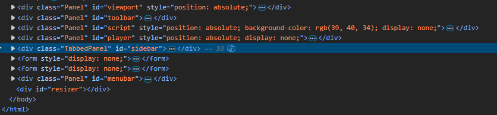
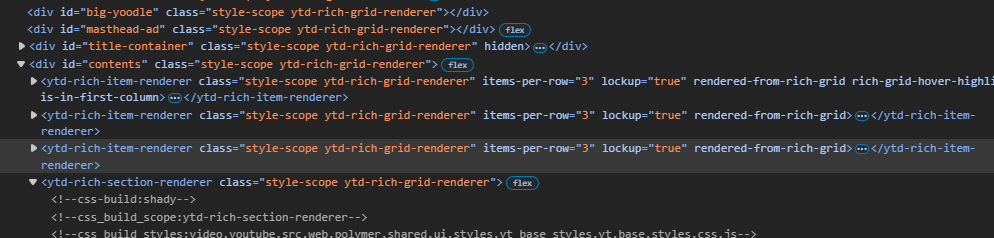

Motivation:
I want to get a better understanding of how to build larger scale apps.
While attempting to build my own Game Engine with a Game Editor I have realized that 
my code was getting very messy and I wanted to look at how other similar projects
handle things at a larger scale. 

I found the three.js editor which is basically the state my project is at right now. Obviously there
editor is way more advanced and includes more things (especially related to Graphics) but I figured
we had a similar project so far so why not break down there code and understand it. Maybe I'll learn something
usefull from it or maybe I give up halfway and leave more confused than before. Only time will tell.


1) 
index.html
The team behind three.js's in house editor seems to take an approach I have not seen other apps do whenever
I briefly look at their code. That being easy to follow components that make up the entire page. Generally if we
take a look at something like YouTube's html we see deeply nested components with unclear classnames / ids. This
makes it hard to tell what a certain element is for. In comparison, three.js's editor has only 9 main elements 
visible in the html. All other sub elements are nested parts of these components. I may be wrong as I've never
made a GUI app that wasn't a webapp, but I believe this is how desktop GUI apps work. They have main components
and within those main components things can be added like tabs, buttons etc. Whereas a webapp is more just
a bunch of containers with things inside them...

three.js editor html


YouTube homepage html 

(A <ytd-rich-item-renderer> element indicates a single YouTube video thumbnail + title card thingie)

The components are added via js `element.appendChild(element)` instead of being created directly on the
html and then retrieved via a query for some reason.

After each component is created, something is done with the Editor object so it is only natural we explore that
first.


2) 
js/Editor.js
A lot of files are imported into Editor.js. The most notable (for me) are THREE which I believe is the
file responsible for the graphics after a quick skim. Another notable file is Selector.js which seems
to be responsible for interaction within the viewport. I will review that later.

The next bit of code 
```
var _DEFAULT_CAMERA = new THREE.PerspectiveCamera( 50, 1, 0.01, 1000 );
_DEFAULT_CAMERA.name = 'Camera';
_DEFAULT_CAMERA.position.set( 0, 5, 10 );
_DEFAULT_CAMERA.lookAt( new THREE.Vector3() );
```

is responsible for setting up the code for the editor's viewport. I find it weird that its done here rather than in the viewport class / function but we may find out why. They also seem to combine the Projection matrix and View matrix
here as a single "camera" object which I quite like and will copy for my code.

The first variable within the Editor function is 
`const Signal = signals.Signal`
I don't quite understand where the `signals` object comes from yet. It seems that within the `signals` object there is another object
`Signal` which, based on the use of the new keyword later, is kind of like a class.

Then a new object is created for the `Editor`, `this.signals` with all the signals. Which we will get into next.


3) 
js/libs/signals.js
I don't believe this was created by the three.js team, but this seems to be the thing that mistifies me the most. A lot of the
syntax used here is foreign to me so I had some help from ChatGPT.

The file begins with `(function(i){ . . . }(this))` which is the outer wrapper. This is an immediately invoked function expression
(IIFE) meaning it runs right away and keeps all internal variables private. The parameter `i` is the global object (`this` --> `window`).

More info on IIFEs. An IIFE is an idiom in which a JS function runs as soon as it is defined, also known as a **self-executing anonymous function**